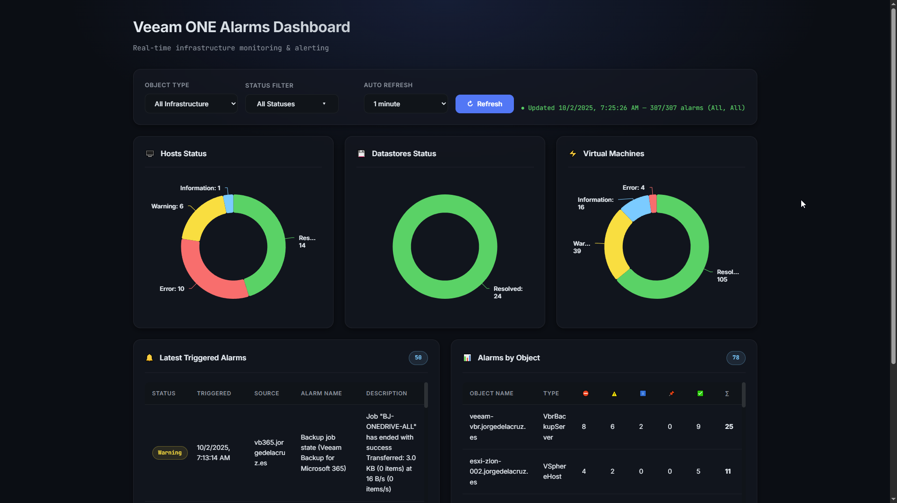

# Veeam ONE Alarms Dashboard (HTML + PowerShell JSON Feeder)



A lightweight, no‑CORS dashboard for **Veeam ONE triggered alarms**.  
It uses a **PowerShell collector** to authenticate against the Veeam ONE REST API and export the latest alarms to `data.json`.  
A **static HTML** app (no backend) reads that JSON and renders charts and tables.

> ✅ Zero server code.  
> ✅ Works on IIS, Nginx, Apache, or just `file://` + a scheduled job.  
> ✅ Filters by **Object Type** and **Status**.  
> ✅ Consistent colors (Resolved / Warning / Error / Information / Acknowledged).

---

## How it works

```
+--------------------+        Veeam ONE HTTPS (Rest API)
| PowerShell script  |  --->  /api/token 
| Get-VoneAlarms.ps1 |  --->  /api/v2.3/... 
+---------+----------+                                     
          | writes data.json                               
          v                                                
+---------+-----------------------------+
| Static HTML (index.html + Highcharts) |  
+--------------------------------------+
```

No browser → API calls are made. The **PowerShell script** does the auth and data pull, so the browser loads only `data.json`. That means **no CORS headaches** and it works behind **any** static web server.

---

## Repo layout

```
/
├─ index.html                 # The dashboard UI
├─ Get-VoneAlarms.ps1         # PowerShell collector (auth + fetch + write JSON)
├─ config.json                # Credentials and API settings for the collector
├─ data.json                  # Output JSON consumed by the UI (generated)
└─ screenshot.png             # Optional preview for README
```

---

## Requirements

- Windows PowerShell 5.1+ (or PowerShell 7) on the machine running the collector
- Network access from the collector host to the Veeam ONE server (`443/1239` etc. as applicable)
- A place to host the static files (IIS / Nginx / Apache / GitHub Pages* / file share)
  - \*If you host the HTML on GitHub Pages or a CDN, **run the collector somewhere reachable** and push `data.json` there on a cadence.

---

## Quick start

1) **Drop the files** into a folder (e.g. `C:\inetpub\wwwroot\vo-alarms` so we leverage the native IIs Veeam ONE has).

2) **Create `config.json`** (same folder as the script):

```json
{
  "baseUrl": "https://veeamone.example.com:1239",
  "username": "DOMAIN\\adminuserinvone",
  "password": "YOUROWNPASS",
  "apiVersion": "v2.3",
  "limit": 400
}
```

3) **Run the collector** once to generate `data.json`:

```powershell
cd C:\inetpub\wwwroot\vo-alarms
.\Get-VoneAlarms.ps1 -Config .\config.json -OutFile .\data.json
```

4) **Open the dashboard**  
   - If hosting on IIS: `https://<your-host>/vo-alarms/`  
   - If opening locally: double‑click `index.html` (or run a tiny static server).

5) **Schedule it** (Windows Task Scheduler):  

- **Action**:  
  Program/script: `powershell.exe`  
  Arguments:  
  ```
  -NoProfile -ExecutionPolicy Bypass -File "C:\inetpub\wwwroot\vo-alarms\Get-VoneAlarms.ps1" -Config "C:\inetpub\wwwroot\vo-alarms\config.json" -OutFile "C:\inetpub\wwwroot\vo-alarms\data.json"
  ```
  Start in: `C:\inetpub\wwwroot\vo-alarms`

- **Trigger**: Every 1–5 minutes (match your dashboard auto‑refresh).

---

## The dashboard (index.html)

- **Filters**
  - **Type**: All / vSphere / VBR / VB365 (regex match on `alarmSource.objectType`)
  - **Status**: Multi‑select chips (Error, Warning, Information, Acknowledged, Resolved)
- **Charts**
  - Three donut charts (Hosts / Datastores / VMs) with unified colors
  - No borders / shadows; darken on hover only
- **Tables**
  - Latest 50 alarms (Status, Time, Source, Name, Description)
  - “Alarms by object” aggregation, with compact status columns

**Colors (consistent across charts & UI):**

| Status        | Color var |
|---------------|-----------|
| Resolved      | `--ok`    |
| Warning       | `--warn`  |
| Error         | `--err`   |
| Information   | `--info`  |
| Acknowledged  | `--ack`   |

Change them at the top of `index.html` in `:root{ ... }`.

---

## The collector (Get-VoneAlarms.ps1)

**What it does**
- Authenticates to Veeam ONE (`/api/token`) using `username/password`
- Calls `/api/{version}/alarms/triggeredAlarms?Offset=0&Limit=<limit>`
- Serializes the payload to **UTF‑8** `data.json` located next to the script
- Adds a `generatedAt` ISO timestamp

**Usage**

```powershell
.\Get-VoneAlarms.ps1 -Config .\config.json -OutFile .\data.json
```

**Notes**
- If your Veeam ONE uses a self‑signed certificate, the script includes an optional certificate validation bypass guard (toggle inside the script). Prefer installing the proper CA chain instead.
- `-OutFile` may be **relative** or **absolute**. The script resolves it against the current directory if relative.

**Example output shape (`data.json`)**

```json
{
  "generatedAt": "2025-10-01T12:34:56.789Z",
  "totalCount": 307,
  "items": [
    {
      "triggeredAlarmId": 22,
      "name": "VM total disk latency",
      "triggeredTime": "2025-09-28T22:32:49.12Z",
      "status": "Resolved",
      "description": "All metrics are back to normal",
      "alarmSource": { "objectName": "VEEAM-PRX-LINUX-03", "objectType": "VSphereVm" }
    }
  ]
}
```

---

## Security

- Put `config.json` in a secure location or use a secure secret store.
- Minimum permissions account for the API wherever possible  
- Use proper TLS. The cert ignore helper is for Veeam ONE servers without a valid SSL.

---

## Troubleshooting

**Dashboard shows “data.json 404”**  
– The collector hasn’t run yet, or it writes to a different folder. Check the `-OutFile` path and Task Scheduler “Start in” directory.

**Empty charts/tables**  
– Filters might hide everything. Click “Refresh now” and toggle status chips.  
– Confirm `data.json` has `items` and `totalCount` fields.

**401/403 from `/api/token`**  
– Wrong credentials or account permissions. Try in Postman to validate creds and URL.

---

## Customization

- **Colors**: tweak the CSS variables at the top of `index.html`.
- **Auto refresh**: dropdown in the toolbar; change defaults in markup.
- **Object Type mapping**: extend the Type filter predicates if you need more categories.
- **Chart layout**: all charts share a fixed height (`.chart { height: 280px }`); change as desired.

---

## Roadmap (ideas)

- Top offenders: a small table of most noisy objects by last 24h
- CSV/Excel export from current filter
- Badge mode for NOC screens (big numbers only)

---

## License & Support

This is a **community** project. Provided **as‑is** with no warranties and **no vendor support**.  
Please open issues/PRs for bugs and improvements.

---

## Credits

- Built with ❤️ using **PowerShell** and **Highcharts**.
