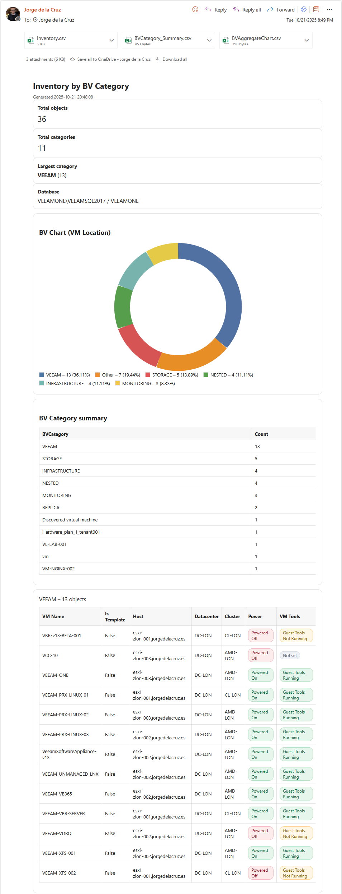

# HTML & Email Report for Veeam ONE — Inventory by Business View



This PowerShell project queries the **Veeam ONE** SQL database via stored procedures to produce a clean **HTML report** and optional **email** showcasing VM inventory grouped by **Business View (BV) Category**. It includes a donut chart (PNG), tidy tables, and downloadable CSVs—ready for ops, audits, or management updates.

> Community project provided “as is”. Please don’t open support tickets with Veeam for this script.

---

## What it pulls from Veeam ONE

- `reportpack.rsrp_Monitor_ChartDetails` – Detailed VM inventory (VM, host, DC, cluster, power/tools status, BV category).
- `reportpack.rsrp_Monitor_VMAggregateChart` (with `@ChartType=2`) – Aggregated counts per BV category (feeds the donut).

---

## Outputs

- **HTML report**: `InventoryByBVCategory.html`  
  - Summary stats  
  - Donut chart by BV Category (PNG)  
  - Category summary table  
  - Per-category detail tables
- **CSV files** (semicolon `;` delimited):
  - `Inventory.csv` – full row-level inventory
  - `BVCategory_Summary.csv` – counts per BV Category
  - `BVAggregateChart.csv` – aggregated counts (after deduping “Other” etc.)
- **Chart image**:
  - `BVAggregateChart.png` – donut chart rendered server-side (GDI+)
- **Email (optional)**:
  - Sends the HTML **inline**, attaches the three CSVs, and embeds the donut as an **inline CID** image

All files are written to:  
`$OutDir = "<script folder>\Output-MonitorChartDetails"`

---

## Getting started

1. **Download / clone** the script (e.g., `PS_VONE_StoredProcedure.rsrp_Monitor_Inventory_VMs_byBusinessView.ps1`).
2. **Edit the parameters** (top of the script):
   - **SQL**  
     - `$SQLServer` – your Veeam ONE SQL instance (e.g., `VEEAMONE\VEEAMSQL2017`)  
     - `$SQLDBName` – your DB name (typically `VeeamONE`)  
     - Business View scope: `$cbBVCategory = "VM Location"`, `$SID = $null`, `$RootIDsXml = "<root><id>1000</id></root>"`
   - **Paths & naming**  
     - `$OutDir` – output folder  
     - `$ReportTitle`
   - **Email (optional, Microsoft Graph App-Only)**  
     - `$RecipientEmail`, `$TenantId`, `$ClientId`, `$ClientSecret`
3. **Run** from an elevated PowerShell 5.1 console:
   ```powershell
   Set-ExecutionPolicy RemoteSigned -Scope Process
   .\PS_VONE_StoredProcedure.rsrp_Monitor_Inventory_VMs_byBusinessView.ps1
   ```
4. **Open** the generated `InventoryByBVCategory.html` (or check your inbox if email is enabled).

---

## Prerequisites

- **Windows PowerShell 5.1**
- **Access to Veeam ONE SQL** (Integrated Security or SQL Auth if you adapt the connection string)
- **.NET GDI+** (`System.Drawing`) for PNG rendering
- **Optional email**:
  - `MSAL.PS` module:
    ```powershell
    Install-Module MSAL.PS -Force
    ```
  - An **Azure App Registration** with **Application permission** `Mail.Send` (granted admin consent)

---

## Key features

**Fast & efficient data retrieval**
- Uses Veeam ONE stored procedures for both detail and aggregate data.
- Aggregates duplicate categories (e.g., multiple **Other** rows) correctly.

**Readable, lightweight HTML**
- No external JS/CSS frameworks.
- Clear summary tiles, compact tables, and collapsible per-category sections.

**Chart that works in email**
- Renders a **PNG donut** (not SVG) so it displays across Outlook/OWA/Gmail/Apple Mail.
- HTML report uses the same PNG and a matching legend.

**Console UX**
- Step-by-step progress with colorized messages.
- Defensive error handling around SQL and Graph calls.

---

## Email integration (optional)

The script can send the report via **Microsoft Graph (app-only)**:

1. **Azure App Registration**
   - App-only **Application** permission: `Mail.Send` (admin consent required).
   - Record **TenantId**, **ClientId**, and create a **Client Secret**.

2. **Set variables** in the script:
   ```powershell
   $RecipientEmail = "you@yourdomain.com"
   $TenantId       = "contoso.onmicrosoft.com"
   $ClientId       = "<GUID>"
   $ClientSecret   = ConvertTo-SecureString "<your-secret>" -AsPlainText -Force
   ```

3. **What gets sent**
   - Inline HTML body (your entire report)
   - Inline **CID** image: `BVAggregateChart.png`
   - Attachments: `Inventory.csv`, `BVCategory_Summary.csv`, `BVAggregateChart.csv`

> The token request uses the `.default` scope to avoid interactive prompts and hangs.

---

## Customization

**Business View scope**  
- Adjust `$cbBVCategory`, `$SID`, `$RootIDsXml` to target a different BV branch or scope.

**Look & feel**  
- Tweak the `$style` CSS block for branding.
- Adjust donut size in `New-DonutPng` call (e.g., `-Size 360 -Stroke 44`).

**Data columns**  
- Modify the `$rows = $dt | Select-Object ...` mapping to add/remove fields.

**CSV delimiter**  
- Currently `;` (semicolon) for European locales—switch to `,` if preferred.

---

## Scheduling

Use **Windows Task Scheduler**:
- Action: `powershell.exe`
- Arguments:
  ```text
  -NoLogo -NoProfile -ExecutionPolicy Bypass -File "C:\Path\PS_VONE_StoredProcedure.rsrp_Monitor_Inventory_VMs_byBusinessView.ps1"
  ```
- Run as a service account with SQL read rights and Graph permission (for email).

---

## Troubleshooting

**Script stalls at email send**  
- Ensure token request includes:
  ```powershell
  Get-MsalToken -Scopes "https://graph.microsoft.com/.default"
  ```
- If it fails, the catch block prints the Graph error JSON.

**SVG didn’t render in email**  
- Expected. The script embeds a **PNG** instead (CID image) for broad client compatibility.

**GDI+ errors drawing the chart**  
- Make sure the rectangle args are **parenthesized & cast to int**.  
- Use `LineCap::Flat` for line caps (not `Butt`).

**Encoding glitches (smart dashes)**  
- The HTML uses entities like `&ndash;`. Avoid “smart quotes/dashes” in raw strings.

---

## Security notes

- This project **reads** from Veeam ONE DB; it does not modify data.  
- Store secrets securely (Key Vault, DPAPI, or environment variables).  
- App-only email can send as any mailbox—limit and monitor that permission.

---

## Known limitations

- Built/tested on **Windows PowerShell 5.1**.
- Very large environments may take longer to render the tables and PNG.
- If your BV tree is huge, consider tightening the BV scope (`$RootIDsXml`, etc.).

---

## File map

```
/PS_VONE_StoredProcedure.rsrp_Monitor_Inventory_VMs_byBusinessView.ps1
/Output-MonitorChartDetails/
  ├─ InventoryByBVCategory.html
  ├─ Inventory.csv
  ├─ BVCategory_Summary.csv
  ├─ BVAggregateChart.csv
  └─ BVAggregateChart.png
EmailReport.png   ← screenshot for this README
```

---

### Credits & License

- Author: **Jorge de la Cruz** — https://jorgedelacruz.uk/  
- Community project; no vendor support.  
- Feel free to fork and improve.
